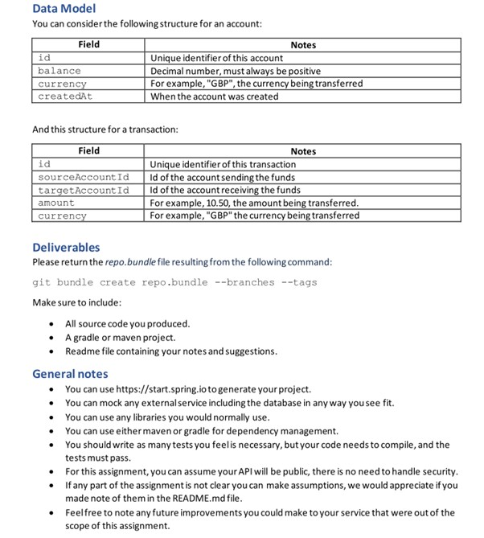

# TransactionBanking Demo - Overview

JUnit Test
------------------

If you have git-bash installed and configured in the path then use below command to checkout source code into your system,

git clone https://github.com/pmjobsearch00/TransactionBanking.git

If you have maven installed and in the path then use below command to build and run junit test cases that proves the core functions,

Go to the folder where the code is checked-out (you should see the pom.xml in your current folder)

cd TransactionBanking

mvn clean install

`The ReST service APIs are available at com.tenx.sample.controllers.AccountRestAPIController.java,  com.tenx.sample.controllers.TransactionRestAPIController.java and corresponding JUnit tests classes in the test folder`

Run Application
--------------------------
mvn spring-boot:run

Test from Browser (GUI)
-------------------------

Once the applications is up and running by using above run command open a browser and test the application using below url

http://localhost:8080/

